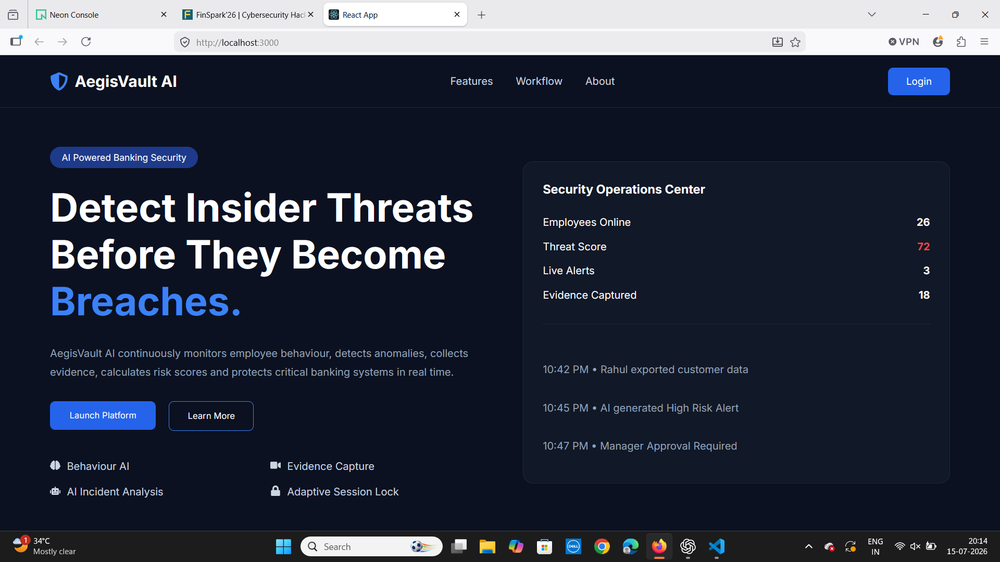

# 🛡️ AegisVault AI

<p align="center">

### AI-Powered Insider Threat Detection & Response System

An intelligent cybersecurity platform that detects, investigates, and responds to insider threats using Artificial Intelligence, Behavioral Analytics, Digital Forensics, and Risk-Based Access Control.

</p>

---

## 📖 Overview

AegisVault AI is an AI-powered insider threat detection platform designed to identify suspicious employee behavior before it becomes a security incident.

The system continuously monitors user activities, calculates a dynamic risk score, collects digital forensic evidence when suspicious behavior is detected, generates AI-powered investigation reports, and automatically adapts employee permissions based on risk level.

The project demonstrates how Artificial Intelligence can be combined with cybersecurity principles to improve enterprise security and reduce insider threats.

---

# ✨ Features

## 🧠 Behavioral Intelligence Engine

- Monitors employee behavior
- Detects anomalous activities
- Calculates AI Risk Score (0–100)
- Generates Confidence Score
- Creates Insider Threat Alerts

---

## 📂 Evidence Collector

Automatically collects digital evidence when suspicious activity is detected.

Collected evidence includes:

- Activity Logs
- Screen Recordings
- Screenshots
- Access History
- Time Stamps

---

## 🤖 AI Incident Analyst

Automatically generates:

- Investigation Timeline
- Threat Analysis
- Risk Explanation
- Severity Level
- AI Recommendation

---

## 🔒 Adaptive Session Lock

Dynamic permission control based on risk score.

| Risk Level | Action |
|------------|---------------------------|
| 🟢 Low | Full Access |
| 🟡 Medium | Read-Only Access |
| 🟠 High | Pause Sensitive Actions |
| 🔴 Critical | Manager Approval Required |
| 🚫 Very Critical | Account Locked |

---

## ✅ Context-Aware Critical Operation Validation

Before executing sensitive operations, the system verifies:

- Employee Role
- Current Risk Score
- Previous Behavior
- Access Permissions
- Manager Approval

Actions are:

- ✅ Allowed
- ⏳ Approval Required
- ❌ Blocked

---

# 🏗️ System Workflow

```
Employee Activity
        │
        ▼
Behavior Monitoring
        │
        ▼
Behavioral Intelligence Engine
        │
        ▼
Risk Assessment
        │
        ▼
Evidence Collection
        │
        ▼
AI Investigation
        │
        ▼
Adaptive Security Response
```

---

# 💻 Tech Stack

### Frontend

- React.js
- React Router
- Axios
- Framer Motion
- CSS3
- React Icons

### Backend

- Flask
- SQLAlchemy
- Flask JWT
- Flask CORS
- Werkzeug

### Database

- PostgreSQL

---

# 📂 Project Structure

```
AegisVault-AI
│
├── backend
│   ├── models
│   ├── routes
│   ├── uploads
│   │     ├── recordings
│   │     └── screenshots
│   ├── app.py
│   └── requirements.txt
│
├── frontend
│   ├── components
│   ├── pages
│   ├── css
│   ├── data
│   └── App.js
│
├── screenshots
│
└── README.md
```

---

# 📸 Project Screenshots

<p align="center">


</p>

---


<p align="center">


</p>

---

<p align="center">


</p>

---

<p align="center">


</p>

---

# 📊 Admin Dashboard

The administrator dashboard provides:

- Organization Risk Score
- Employee Monitoring
- AI Investigation Report
- Activity Timeline
- Evidence Viewer
- Live Incident Feed
- Employee Lock/Unlock
- Adaptive Security Controls

---

# 👤 Employee Dashboard

Employees can:

- Login Securely
- Access Authorized Features
- Upload Evidence
- Perform Daily Operations
- Receive Permission Requests

---

# 📈 Risk Levels

| Risk Score | Level |
|------------|-------|
| 0 – 39 | 🟢 Low |
| 40 – 69 | 🟡 Medium |
| 70 – 89 | 🟠 High |
| 90 – 100 | 🔴 Critical |

---

# 🚀 Installation

## Clone Repository

```bash
git clone https://github.com/your-username/AegisVault-AI.git
```

---

## Backend

```bash
cd backend

pip install -r requirements.txt

python app.py
```

---

## Frontend

```bash
cd frontend

npm install

npm start
```

---

# 🔑 Default Admin Login

```
Email:
admin@aegisvault.com

Password:
Admin@123
```

---

# 🔒 Security Features

- JWT Authentication
- Role-Based Access Control
- AI Risk Assessment
- Behavioral Analytics
- Digital Forensics
- Session Locking
- Evidence Collection
- Adaptive Authorization

---

# 🎯 Future Enhancements

- Machine Learning Models
- Email Alerts
- SIEM Integration
- Multi-Factor Authentication
- Face Verification
- Cloud Deployment
- Explainable AI
- Threat Intelligence Integration

---

# 👨‍🎓 Academic Project

This project was developed to demonstrate how Artificial Intelligence can improve cybersecurity by detecting insider threats, collecting digital evidence, performing automated investigations, and preventing unauthorized actions through adaptive access control.

---

# 📄 License

This project is intended for educational and research purposes only.

---

⭐ If you found this project useful, consider giving it a star on GitHub!
